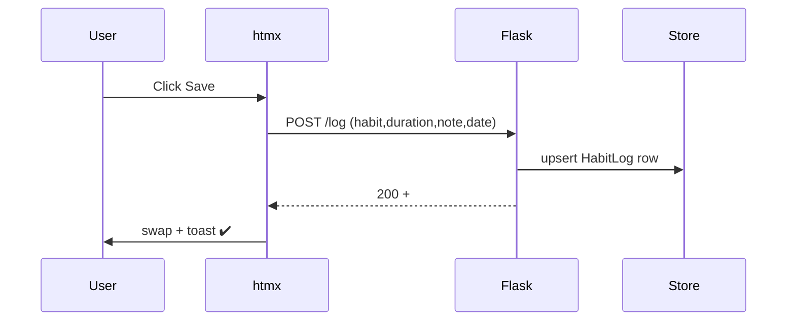
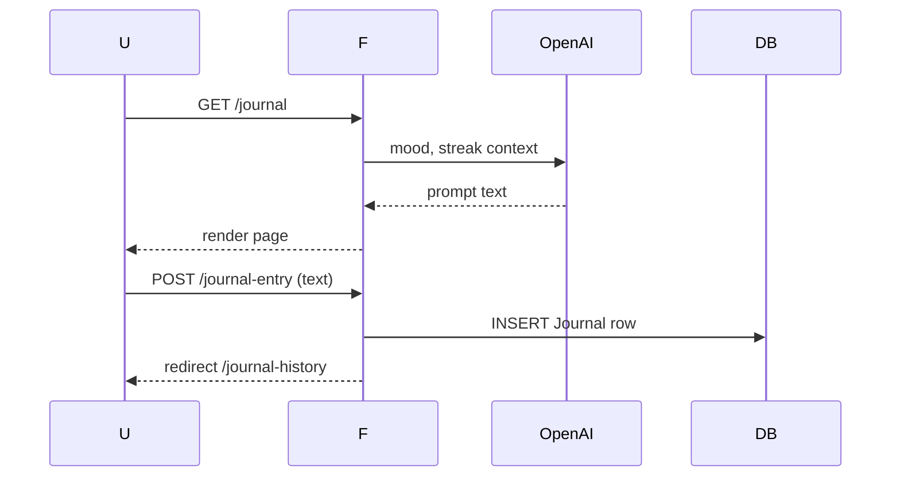

# 🧠 Architecture Notes — `Habit Tracker`

*Last updated 20 Jun 2025*

---

## 1 · High‑Level Overview

Habit‑Track is a lightweight, ADHD‑friendly tracker for **habits, mood, and reflective journaling**. It runs **locally by default** yet can be deployed as a PWA.

```
Flask → Jinja2 → htmx → Alpine.js → vanilla CSS
        │                 │
        └── Analytics (Chart.js)
SQLite / Postgres
```

All day‑to‑day interactions happen on four routes:

| Route              | Purpose                                          |
| ------------------ | ------------------------------------------------ |
| `/`                | One‑page habit grid, mood slider, Log/Edit modal |
| `/journal`         | AI‑seeded prompt + textarea to write entry       |
| `/journal-history` | Scrollable archive of past entries + downloads   |
| `/analytics`       | Bar charts (habit durations) + mood line chart   |

htmx swaps only the relevant fragment on each page, so full reloads are rare.

---

## 2 · Core Design Goals

| ID  | Goal                      | Success Signal                               |
| --- | ------------------------- | -------------------------------------------- |
| G‑1 | **Log a habit in < 10 s** | One click/tap + Save toast                   |
| G‑2 | **Own the data**          | JSON dev / SQLite prod; one‑click export     |
| G‑3 | **Zero downtime offline** | PWA manifests + service‑worker cache         |
| G‑4 | **Reliable Save**         | Static `/log` endpoint, toast shows ✔️       |
| G‑5 | **Guided reflection**     | GPT‑generated prompt when mood logged        |
| G‑6 | **Insightful analytics**  | `/analytics` loads < 300 ms, charts reactive |

---

## 3 · Updated Tech Stack

| Layer             | Technology                                | Why                    |
| ----------------- | ----------------------------------------- | ---------------------- |
| Backend           | **Flask 2**                               | Routing + Jinja        |
| Front‑end runtime | **htmx 1.9** • **Alpine 3.13**            | 6 kB each, declarative |
| Charts            | **Chart.js 4** (imported on `/analytics`) | Zero build step        |
| Styling           | Vanilla CSS + dark‑mode class             |  Lightweight           |
| AI Integration    | OpenAI GPT‑4o via `/journal-prompt`       | Generates daily prompt |
| PWA               | Workbox‑generated service worker          | Offline‑first          |
| Persistence       | JSON (dev) ➜ SQLite or Postgres (prod)    | Own data               |
| Tests             | **Pytest** (unit) • **Playwright** (e2e)  | CI coverage            |
| Optional CLI      | Typer + Rich (legacy)                     | Terminal lovers        |

---

## 4 · Data Model

### 4.1 HabitLog table

| col        | type      | note        |
| ---------- | --------- | ----------- |
| `date`     | DATE PK₁  |             |
| `habit`    | TEXT PK₂  |             |
| `duration` | INT       | minutes     |
| `note`     | TEXT      | optional    |
| `ts`       | TIMESTAMP | server time |

### 4.2 Mood table

| col     | type      |
| ------- | --------- |
| `date`  | DATE PK   |
| `score` | INT (1‑5) |
| `ts`    | TIMESTAMP |

### 4.3 Journal table

| col      | type      | note                     |
| -------- | --------- | ------------------------ |
| `id`     | SERIAL PK |                          |
| `date`   | DATE      | one per day              |
| `text`   | TEXT      | Markdown/string          |
| `prompt` | TEXT      | GPT prompt shown to user |
| `ts`     | TIMESTAMP | save time                |

*(If using JSON, journals live under `journal:{date}` keys.)*

---

## 5 · Request Flows

### 5.1 Habit save



### 5.2 Journal prompt + save



---

## 6 · Component Map

| Path                                         | Role                                                                                                                 |
| -------------------------------------------- | -------------------------------------------------------------------------------------------------------------------- |
| `app.py`                                     | Routes: `/`, `/log`, `/mood`, `/journal`, `/journal-entry`, `/journal-history`, `/analytics`, `/export`, `/settings` |
| `templates/index.html`                       | Habit grid + modal + toast                                                                                           |
| `templates/journal.html`                     | Prompt + textarea                                                                                                    |
| `templates/journal_history.html`             | Past entries browser                                                                                                 |
| `templates/analytics.html`                   | Chart.js dashboards                                                                                                  |
| `templates/_habit_row.html`                  | Weekly‑grid partial                                                                                                  |
| `static/htmx.min.js`, `static/alpine.min.js` | Front‑end micro‑libs                                                                                                 |
| `static/chart.min.js`                        | Loaded only on `/analytics`                                                                                          |
| `static/service-worker.js`                   | Workbox build output                                                                                                 |
| `storage.py`                                 | DB / JSON adapter                                                                                                    |
| `openai_client.py`                           | Thin helper around `openai.ChatCompletion`                                                                           |
| `tests/`                                     | Pytest unit specs                                                                                                    |
| `e2e/`                                       | Playwright specs                                                                                                     |

---

## 7 · Feature Matrix (Web vs CLI)

| Capability      | Web UI      | CLI (`habit.py`)    |
| --------------- | ----------- | ------------------- |
| Log habit       | ✅           | ✅ `log <key> <min>` |
| Log mood        | ✅           | ✅ `mood <score>`    |
| Weekly view     | ✅           | ✅ `show`            |
| Settings        | ✅           | 🚧 (edit JSON)      |
| Journal prompt  | ✅ (OpenAI)  | ❌                   |
| Write journal   | ✅           | ❌                   |
| Journal history | ✅           | ❌                   |
| Analytics page  | ✅           | ❌                   |
| Export CSV      | ✅ `/export` | ❌ (planned)         |

---

## 8 · Test Strategy

| Level | Tool           | Assertions                                                                              |
| ----- | -------------- | --------------------------------------------------------------------------------------- |
| Unit  | Pytest         | `/log`, `/mood`, `/journal-entry` return **200**, DB rows created                       |
| E2E   | Playwright     | 1) Log habit → ✅ badge 2) Write journal → appears in history 3) Analytics charts render |
|       |                | *(install via `npm ci && npx playwright install --with-deps`)* |
|       |                | *(tests skip if Playwright missing)* |
| CI    | GitHub Actions | Runs both suites; Dependabot PRs auto-tested                                            |

> **Dep‑drift guard:** Pin **Click 8.1.x** *or* upgrade **Typer ≥ 0.12** to avoid `CliRunner` mismatch.

---

## 9 · Roadmap 2025 H2

| Ver. | ETA | Highlights                             |
| ---- | --- | -------------------------------------- |
| 0.5  | Jul | Habit‑streak push notifications        |
| 0.6  | Aug | CSV export; advanced analytics filters |
| 1.0  | Q4  | Mobile‑first UI polish; full doc site  |

---

## 10 · Contributing

```bash
git clone https://github.com/jake0lawrence/habit-track-cli.git
cd habit-track-cli
python -m venv .venv && source .venv/bin/activate
pip install -r requirements.txt
python app.py  # Flask dev server
pytest -q && npx playwright test  # unit + e2e
```

PRs welcome—include unit/e2e coverage for new features.

---

## 11 · License & Author

**MIT** — see [`LICENSE`](../LICENSE)
Author: **Jake Lawrence** — [https://jakelawrence.io](https://jakelawrence.io)

> *Footnote*: The original Typer/Rich CLI lives on in `habit.py`; still functional but web UI is primary.
