# 🧠 Architecture Notes — `Habit Tracker`

_Last updated 20 Jun 2025_

---

## 1 · High-Level Overview

Habit-Track is a lightweight, ADHD-friendly habit & mood tracker that runs **locally by default** yet can be deployed as a PWA.  
The stack is intentionally minimal:

Flask → Jinja2 → htmx → Alpine.js → vanilla CSS
SQLite | Postgres

All UI interactions happen on a single page (`/`) where htmx swaps the weekly-grid
fragment without reloading the rest of the DOM.

---

## 2 · Core Design Goals

| ID | Goal | Success signal |
|----|------|----------------|
| G-1 | **Log a habit in < 10 s** | One click/tap + Save |
| G-2 | **Zero vendor lock-in** | Data stored as JSON/SQLite you can export any time |
| G-3 | **Never lose a log** | LocalStorage + DB double-write; PWA works offline |
| G-4 | **Bullet-proof “Save”** | Static `/log` endpoint + unit + e2e tests |
| G-5 | **Extensible** | New habits are declared in `config.json`; no code mods |

---

## 3 · Updated Tech Stack

| Layer              | Technology                                        | Rationale |
|--------------------|---------------------------------------------------|-----------|
| Backend            | **Flask 2**                                       | Simple routing & Jinja |
| Server-side Templ. | **Jinja2**                                        | Zero JS build step |
| Frontend runtime   | **htmx 1.9** + **Alpine 3.13**                    | 6 kB each, declarative |
| Styling            | Vanilla CSS                                       | Dark-mode via class toggle |
| Persistent store   | JSON (dev) → SQLite or Postgres (prod)            | Local first, cloud optional |
| PWA                | Workbox-generated service worker                  | Offline caching |
| Tests              | **Pytest** (unit) • **Playwright** (e2e)          | CI-grade coverage |
| Optional CLI       | Typer + Rich (legacy)                             | Maintained for power users |

---

## 4 · Data Model

### 4.1 Habit Log Table (SQL schema)

| Column | Type | Notes |
|--------|------|-------|
| `date` | `DATE` (PK1) | `YYYY-MM-DD` |
| `habit` | `TEXT` (PK2) | Habit key (`Meditation`, etc.) |
| `duration` | `INTEGER` | Minutes |
| `note` | `TEXT` | Optional |
| `ts` | `TIMESTAMP` | Server time inserted |

### 4.2 Mood Table

| Column | Type |
|--------|------|
| `date` | `DATE` (PK) |
| `score` | `INTEGER` (1-5) |
| `ts` | `TIMESTAMP` |

*(JSON dev mode mirrors the same structure in a nested dict.)*

---

## 5 · Request Flow

```mermaid
sequenceDiagram
  participant U as User (browser)
  participant A as Alpine
  participant H as htmx
  participant F as Flask
  participant DB as SQLite / Postgres

  U->>A: Click “Log”
  A->>A: showModal = true<br/>populate form
  U->>H: Click “Save”
  H->>F: POST /log (habit, duration, note, date)
  F->>DB: insert / update
  F-->>H: 200 + #habit-grid HTML
  H->>U: swap grid
  A->>LS: cache duration & note
```

---

### Why a **static `/log`** endpoint matters  
* Because the URL never changes, htmx attaches its AJAX handler once at page-load—no race conditions when Alpine later mutates attributes.*

---

## 6 · Component Map

| File / Path | Role |
|-------------|------|
| `app.py` | Flask factory&nbsp;+ routes (`/`, `/log`, `/mood`, `/settings`, …) |
| `templates/index.html` | Main UI shell (summary tiles, grid, modal) |
| `templates/_habit_row.html` | Partial that renders the weekly grid rows |
| `static/htmx.min.js`, `static/alpine.min.js` | Front-end micro-libs |
| `static/service-worker.js` | Workbox build output (PWA) |
| `storage.py` | DB or JSON adapter (`save`, `delete`, `get_range`) |
| `tests/` | Pytest unit specs |
| `e2e/` | Playwright tests (`log-save.spec.ts`) |

---

## 7 · CLI vs Web Feature Matrix

| Capability | Web UI | CLI (`habit.py`) |
|------------|--------|------------------|
| Log habit  | ✅ | ✅ `log <key> <min>` |
| Log mood   | ✅ | ✅ `mood <score>` |
| Weekly view| ✅ (grid) | ✅ `show` |
| Settings   | ✅ (form) | 🚧 (edit JSON manually) |
| Export CSV | ✅ `/export` | ❌ (planned) |

---

## 8 · Test Strategy

| Level | Tool | Key assertions |
|-------|------|----------------|
| **Unit** | Pytest | `/log` returns **200** and row HTML contains habit key |
| **E2E**  | Playwright | “Log → Save” shows ✅ *N* min, persists after reload |
| **CI**   | GitHub Actions | Runs both suites on every push / PR |

> **Dependency-drift guard:** Pin **Click 8.1.x** *or* upgrade **Typer ≥ 0.12**

### Highlights of what changed

| Old doc | New reality |
|---------|-------------|
| Typer + Rich as the primary UI | Flask + htmx + Alpine take center stage; CLI is optional |
| Flat JSON only | Dev: JSON; Prod: SQLite/Postgres |
| Future “chart” command | Now `/analytics` route (browser) |
| Roadmap items updated | Reflect PWA, notifications, analytics |
| Added detailed request flow, component map, test stack | Clarifies static `/log` architecture |
